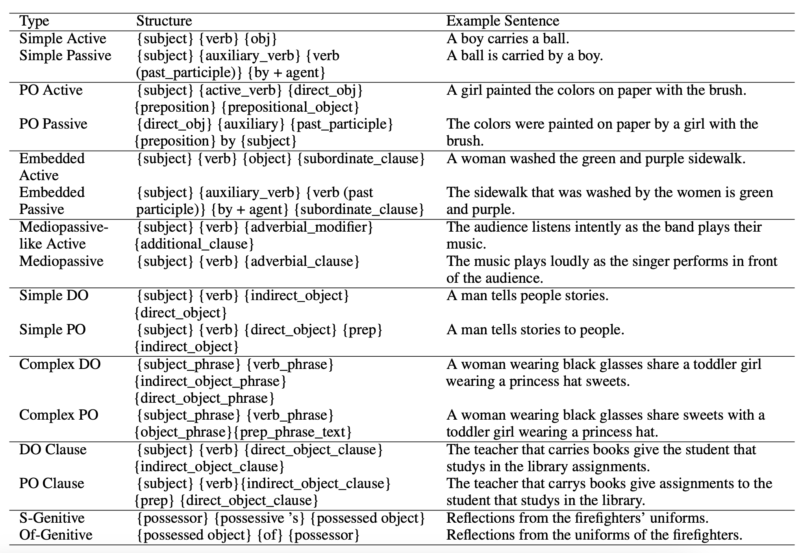
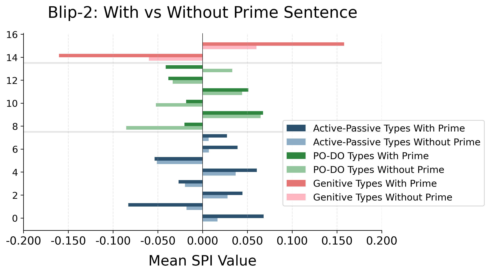
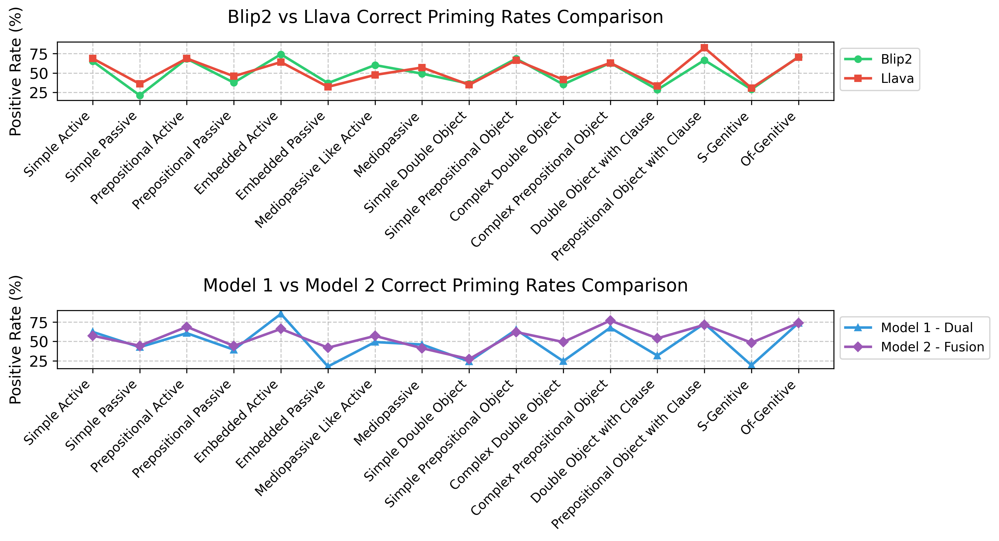
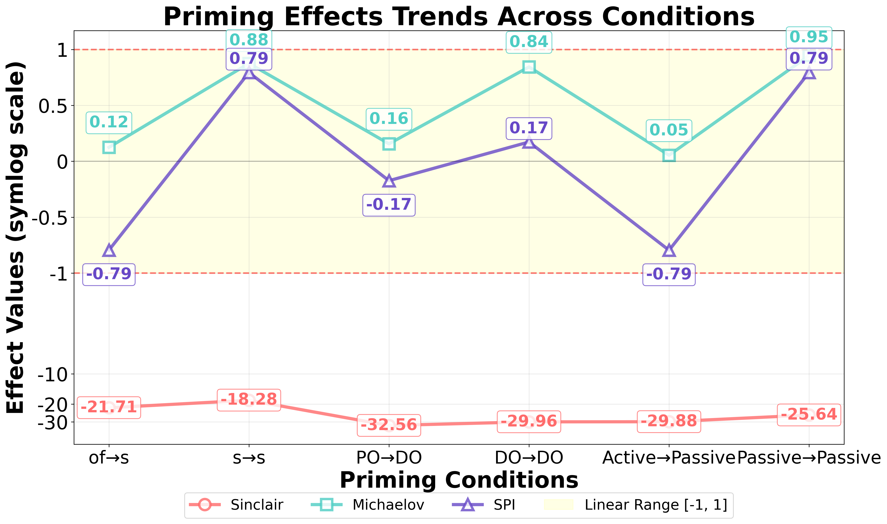

# PRISMATIC

## Dataset Overview

**PRISMATIC** is the first multimodal structural priming dataset with 4k aligned image-sentence pairs, establishing a standardized benchmark that advances computational linguistics research in vision-language syntactic interactions.

## Key Contributions

1. **Novel Multimodal Dataset**: PRISMATIC provides paired images and sentences designed to study structural priming effects in vision-language contexts, filling a critical gap in computational linguistics research.

2. **Syntactic Preservation Index (SPI)**: We introduce SPI, a novel tree kernel-based evaluation metric that quantifies structural priming effects without requiring reference answers. SPI provides the first sentence-level measurement standard for multimodal syntactic preservation with superior interpretability.

## Dataset Statistics

### Train Set
- **Total Sentences**: 3,202
- **Total Images**: 780
- **Label Distribution**:
  - Label 0: 203 sentences
  - Label 1: 203 sentences
  - Label 2: 197 sentences
  - Label 3: 197 sentences
  - Label 4: 195 sentences
  - Label 5: 195 sentences
  - Label 6: 190 sentences
  - Label 7: 190 sentences
  - Label 8: 206 sentences
  - Label 9: 206 sentences
  - Label 10: 201 sentences
  - Label 11: 201 sentences
  - Label 12: 209 sentences
  - Label 13: 209 sentences
  - Label 14: 200 sentences
  - Label 15: 200 sentences

### Test Set
- **Total Sentences**: 1,006
- **Total Images**: 228
- **Label Distribution**:
  - Label 0: 63 sentences
  - Label 1: 63 sentences
  - Label 2: 64 sentences
  - Label 3: 64 sentences
  - Label 4: 69 sentences
  - Label 5: 69 sentences
  - Label 6: 66 sentences
  - Label 7: 66 sentences
  - Label 8: 60 sentences
  - Label 9: 60 sentences
  - Label 10: 61 sentences
  - Label 11: 61 sentences
  - Label 12: 55 sentences
  - Label 13: 55 sentences
  - Label 14: 65 sentences
  - Label 15: 65 sentences

## Source Data

This dataset is built upon the Flickr30k dataset:
- **Hugging Face**: [nlphuji/flickr30k](https://huggingface.co/datasets/nlphuji/flickr30k)

**Citation for Flickr30k**:
```bibtex
@article{young2014image,
  title={From image descriptions to visual denotations: New similarity metrics for semantic inference over event descriptions},
  author={Young, Peter and Lai, Alice and Hodosh, Micah and Hockenmaier, Julia},
  journal={Transactions of the Association for Computational Linguistics},
  volume={2},
  pages={67--78},
  year={2014},
  publisher={MIT Press}
}
```
**Citation for PRISMATIC**:
```bibtex
@misc{xiao2025humancognitionvisualcontext,
      title={Towards Human Cognition: Visual Context Guides Syntactic Priming in Fusion-Encoded Models}, 
      author={Bushi Xiao and Michael Bennie and Jayetri Bardhan and Daisy Zhe Wang},
      year={2025},
      eprint={2502.17669},
      archivePrefix={arXiv},
      primaryClass={cs.CL},
      url={https://arxiv.org/abs/2502.17669}, 
}
```

## Get Dataset

### Step 1: Download Images

Since the original Flickr30k images are distributed as a zip file on Hugging Face, you need to:

1. Download the complete Flickr30k image dataset from [Hugging Face](https://huggingface.co/datasets/nlphuji/flickr30k)
2. Extract the downloaded zip file

### Step 2: Filter Images for PRISMATIC

Run the provided script to extract only the images used in this dataset(need to change the path):

```bash
python get_image.py
```

This script will filter and copy only the images referenced in the PRISMATIC dataset.

## Files

- **`PRISMATIC_full.csv`**: Main dataset file containing sentences with train/test split annotations
- **`data(old).csv`**: Old test data no longer in use
- **`sentence_labels.json`**: The dataset contains 16 distinct labels (0-15) representing different syntactic structures. For detailed information about each label's syntactic pattern, please refer to `sentence_labels.json`.
- **`get_images.py`**: Utility script to extract relevant images from Flickr30k

## Example Sentences



*Example sentences demonstrating 16 syntactic structures*


## Applications

This dataset is designed for:
- Multimodal structural priming research
- Evaluation of large language models' syntactic preservation capabilities
- Cross-modal syntax analysis
- Human vision language experiments

## License

Please refer to the original Flickr30k license for image usage rights.

## Project Structure

### Metrics Module

The `metrics/` directory contains core scripts for calculating and analyzing Syntactic Priming Index (SPI):

####  `metrics/plot_spi.py`
- **Function**: Visualize the patterns and trends of SPI variations

####  `metrics/single_model_SPI.py`
- **Function**: Calculate SPI values for a single model, according to labels
- **Input**: You need to have two generated files, one with prime info and on without prime info as comparison. And you need to have 1 standard data file with positive and negative sentences
- **Output**: Generate CSV filex containing SPI scores for each sentence (with prime info and without prime info)
- **Note**: The output from this script serves as input data for model comparison analysis
- 

####  `metrics/sentence_labels.json`
- **Usage**:Labels of current dataset

#### `metrics/model_comparison.py`
- **Function**: Compare syntactic priming effects across different models
- **Input**: CSV files generated by `single_model_SPI.py` (multiple)
- **Purpose**: Provide cross-model performance comparison on syntactic priming tasks
- 

#### `metrics/test_SPI/caption_generation_result_blip.csv`
- **Usage**: The first version of Blip-2 generated result with priming information. This file has the selected image id, priming labels, the selected sentences to input, the corresponding negative priming sentence, and the output from the Blip-2 model.

#### `metrics/test_SPI/caption_blip_noprime.csv`
- **Usage**: The first version of Blip-2 generated image caption without priming information. This is the control group used in the control experiment. The two csv files are used to test the SPI metric.

#### `metrics/differentMetrics/metrics_comparison.ipynb`
- **Function**: Compare different syntactic priming metrics using GPT-2 as base model
- **Input**: TSV files from previous research:
- **OF-S Genitive**
```bibtex
@article{bernolet2013language,
  title={From language-specific to shared syntactic representations: The influence of second language proficiency on syntactic sharing in bilinguals},
  author={Bernolet, Sarah and Hartsuiker, Robert J and Pickering, Martin J},
  journal={Cognition},
  volume={127},
  number={3},
  pages={287--306},
  year={2013},
  publisher={Elsevier}
}
```
- **PO-DO**
```bibtex
@article{schoonbaert2007representation,
  title={The representation of lexical and syntactic information in bilinguals: Evidence from syntactic priming},
  author={Schoonbaert, Sofie and Hartsuiker, Robert J and Pickering, Martin J},
  journal={Journal of Memory and Language},
  volume={56},
  number={2},
  pages={153--171},
  year={2007},
  publisher={Elsevier}
}
```
- **Active-Passive**
```bibtex
@article{kotzochampou2022similar,
  title={How similar are shared syntactic representations? Evidence from priming of passives in Greek--English bilinguals},
  author={Kotzochampou, Sofia and Chondrogianni, Vasiliki},
  journal={Bilingualism: Language and Cognition},
  volume={25},
  number={5},
  pages={726--738},
  year={2022},
  publisher={Cambridge University Press}
}
```
- **Metrics**
```bibtex
@inproceedings{michaelov2023structural,
  title={Structural priming demonstrates abstract grammatical representations in multilingual language models},
  author={Michaelov, James and Arnett, Carrie and Chang, Tyler and Bergen, Benjamin},
  booktitle={Proceedings of the 2023 Conference on Empirical Methods in Natural Language Processing},
  pages={3703--3720},
  year={2023},
  month={December}

@article{sinclair2022structural,
  title={Structural persistence in language models: Priming as a window into abstract language representations},
  author={Sinclair, Arabella and Jumelet, Jaap and Zuidema, Willem and Fern{\'a}ndez, Raquel},
  journal={Transactions of the Association for Computational Linguistics},
  volume={10},
  pages={1031--1050},
  year={2022},
  publisher={MIT Press}
}
```
- 

